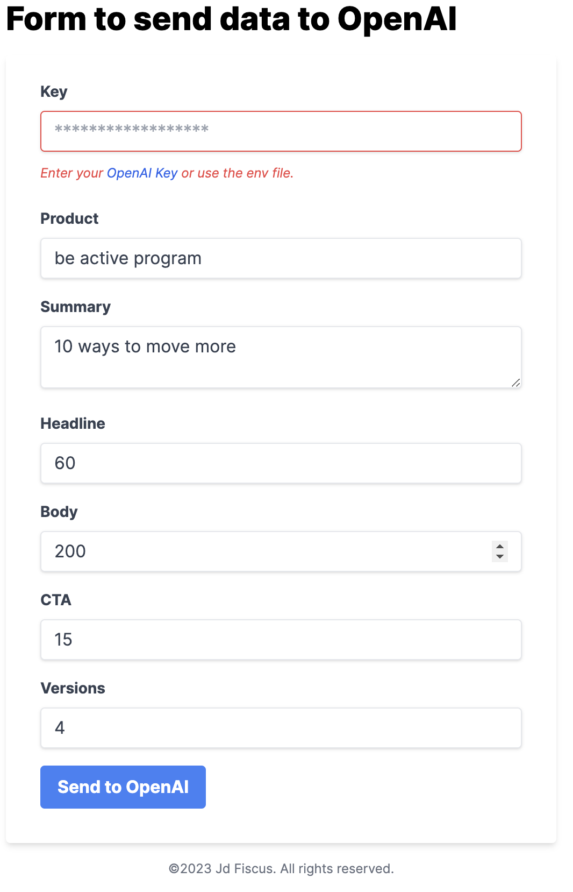

# NextJS OpenAI Form for Creating Variations of a CTA

This project is a web form built with NextJS and integrated with the OpenAI API, allowing users to create variations of a call-to-action (CTA) text by leveraging natural language processing (NLP) technology.


## Getting Started

To get started with the project, you'll need to follow these steps:

1. Clone the repository to your local machine.
2. Install the project dependencies by running `npm install` or `yarn install`.
3. Create an OpenAI API key by following the instructions [here](https://beta.openai.com/docs/quickstart).
4. Create a `.env.local` file at the root of the project and add your OpenAI API key to it using the following format:

```
OPENAI_API_KEY=<your-api-key>
```

5. Run the development server by running `npm run dev` or `yarn dev`.
6. Open your web browser and navigate to `http://localhost:3000` to view the form.

## Usage

The form consists of two input fields: the original CTA text and the desired number of variations. After entering the original CTA text and desired number of variations, the user can click the "Generate Variations" button to generate a list of variations based on the original text.

The variations are generated using OpenAI's GPT-3 natural language processing technology. The form sends a request to the OpenAI API with the original text as the prompt and receives a list of variations in response. The variations are then displayed in a list on the page.

## Contributing

If you'd like to contribute to the project, please fork the repository and submit a pull request. Before submitting a pull request, please ensure that the code adheres to the project's coding standards and that all tests pass.

## License

This project is licensed under the MIT License. See the `LICENSE` file for more information.
